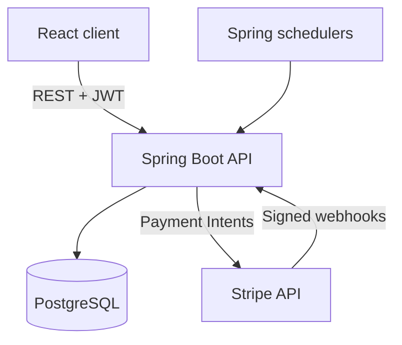

# Cinema Booking Platform

[](https://github.com/MarkoGrozdanovic/cinema-booking-platform/actions/workflows/ci.yml)

A full-stack cinema booking application built with Spring Boot, React, PostgreSQL, and Stripe. Customers can browse screenings, select seats, create bookings, and complete payments. Administrators can manage cinemas, halls, movies, screenings, and bookings.

The project focuses on real-world backend concerns such as concurrent seat selection, transactional booking workflows, signed payment webhooks, automatic expiration, database migrations, integration testing, and containerized deployment.

## Main Features

### Customer features

- Account registration and JWT-based authentication
- Browse upcoming screenings
- View the seat layout and live seat availability
- Select and temporarily hold seats
- Create and review bookings
- Pay securely through Stripe Payment Intents
- Automatic payment-status confirmation after returning from Stripe
- Retry failed payments while the booking remains active
- View booking history and booking details
- Cancel eligible bookings

### Administrator features

- Admin dashboard
- Manage cinemas and their active status
- Manage cinema halls and physical seat layouts
- Manage movies and their active status
- Create and manage screenings
- Automatically complete screenings after they end
- Cancel eligible screenings
- Search, filter, sort, and paginate bookings
- Review booking and payment statuses

### Reliability and security

- Stateless Spring Security with JWT authentication
- Role-based authorization for customers and administrators
- Pessimistic database locking to prevent double booking
- Transactional booking, payment, and seat-state updates
- Automatic expiration of unpaid bookings
- Stripe webhook signature verification
- Idempotent webhook processing
- Reconciliation with Stripe when a webhook is missed
- Flyway database migrations with Hibernate schema validation
- Global validation and exception handling
- Spring Boot Actuator health monitoring
- Docker health checks for PostgreSQL, backend, and frontend
- Automated CI checks with GitHub Actions

## Architecture



The frontend is served by Nginx in Docker. Spring Boot owns the business rules and persistence layer. PostgreSQL stores application state, while Stripe is the source of truth for external payment processing.

## Technology Stack

### Backend

- Java 17
- Spring Boot
- Spring MVC
- Spring Security
- Spring Data JPA and Hibernate
- PostgreSQL
- Flyway
- Stripe Java SDK
- Springdoc OpenAPI and Swagger UI
- Spring Boot Actuator
- Maven

### Frontend

- React
- TypeScript
- Vite
- Tailwind CSS
- React Router
- Axios
- Stripe.js and Stripe Elements

### Testing and infrastructure

- JUnit 5
- Mockito
- Spring MVC tests
- Testcontainers with PostgreSQL
- JaCoCo
- Docker and Docker Compose
- Nginx
- GitHub Actions

## Project Structure

```text
cinema-booking-platform/
├── .github/workflows/       # Continuous integration
├── frontend/                # React and TypeScript application
├── src/main/java/           # Spring Boot source code
├── src/main/resources/
│   └── db/migration/        # Flyway SQL migrations
├── src/test/java/           # Unit, controller, and integration tests
├── docker-compose.yml       # Full application stack
├── Dockerfile               # Backend container image
└── pom.xml                  # Maven configuration
```

## Prerequisites

For the recommended Docker setup:

- Docker Desktop
- Stripe account in test mode
- Stripe CLI for local webhook forwarding

For local development without containerizing every service:

- Java 17
- Node.js 22 or later
- PostgreSQL
- Docker Desktop for Testcontainers integration tests

## Environment Configuration

Create a root `.env` file from `.env.example`:

```powershell
Copy-Item .env.example .env
```

Configure these values:

```env
POSTGRES_DB=cinemabooking
POSTGRES_USER=postgres
POSTGRES_PASSWORD=replace_with_database_password

JWT_SECRET=replace_with_base64_jwt_secret

STRIPE_SECRET_KEY=sk_test_replace_me
STRIPE_WEBHOOK_SECRET=whsec_replace_me
VITE_STRIPE_PUBLISHABLE_KEY=pk_test_replace_me
```

Generate a secure Base64-encoded JWT secret in PowerShell:

```powershell
$bytes = New-Object byte[] 32
[Security.Cryptography.RandomNumberGenerator]::Fill($bytes)
[Convert]::ToBase64String($bytes)
```

Security notes:

- Never commit `.env` or `frontend/.env.local`.
- Never expose `STRIPE_SECRET_KEY`, `STRIPE_WEBHOOK_SECRET`, database credentials, or the JWT secret in frontend code.
- A Stripe publishable key beginning with `pk_test_` is intended for browser use.

## Run the Complete Stack with Docker

Build and start PostgreSQL, the backend, and the frontend:

```powershell
docker compose up -d --build
```

Check container state and health:

```powershell
docker compose ps
```

Application URLs:

| Service | URL |
| --- | --- |
| React application | http://localhost:5173 |
| Spring Boot API | http://localhost:8080/api |
| Swagger UI | http://localhost:8080/swagger-ui/index.html |
| Health endpoint | http://localhost:8080/actuator/health |
| PostgreSQL host port | `localhost:5433` |

Stop the containers without deleting database data:

```powershell
docker compose down
```

The PostgreSQL named volume preserves the database. To remove containers and the database volume deliberately, use:

```powershell
docker compose down -v
```

> `docker compose down -v` permanently deletes the Docker-managed development database.

## Stripe Webhook Setup

Authenticate the Stripe CLI:

```powershell
stripe login
```

Forward test webhooks to the backend:

```powershell
stripe listen --forward-to http://localhost:8080/api/payments/webhook
```

The command prints a signing secret beginning with `whsec_`. Set it as `STRIPE_WEBHOOK_SECRET` in the root `.env` file, then recreate the backend container:

```powershell
docker compose up -d --build backend
```

Keep the Stripe listener running while testing payments. The application processes Payment Intent success, failure, and cancellation events.

Stripe test card for a successful payment:

```text
4242 4242 4242 4242
```

Stripe test card for a declined payment:

```text
4000 0000 0000 0002
```

Use any future expiration date and any three-digit CVC.

## Local Development

### Backend

Ensure PostgreSQL is available and the required environment variables are configured. Then run:

```powershell
.\mvnw spring-boot:run
```

### Frontend

Create `frontend/.env.local`:

```env
VITE_API_BASE_URL=http://localhost:8080/api
VITE_STRIPE_PUBLISHABLE_KEY=pk_test_replace_me
```

Install dependencies and start Vite:

```powershell
npm --prefix frontend install
npm --prefix frontend run dev
```

## Database Migrations

Flyway migrations are stored in:

```text
src/main/resources/db/migration/
```

Flyway applies pending migrations when the backend starts. Hibernate is configured to validate that the entity model matches the migrated schema.

Migration rule: never edit a migration that has already been applied to a shared database. Add a new versioned migration instead, for example:

```text
V3__add_new_feature.sql
```

## API Documentation

With the backend running, open Swagger UI:

```text
http://localhost:8080/swagger-ui/index.html
```

Protected endpoints require a JWT. Log in through the authentication endpoint, copy the returned token, select **Authorize** in Swagger UI, and enter the token.

Main API areas include:

- Authentication
- Screenings and screening seats
- Customer bookings
- Payment Intents and payment status
- Stripe webhooks
- Admin cinemas
- Admin halls and seats
- Admin movies
- Admin screenings
- Admin booking overview

## Testing

Docker Desktop must be running because repository and Flyway integration tests use Testcontainers.

Run the complete backend suite:

```powershell
.\mvnw clean test
```

Open the JaCoCo report:

```powershell
Start-Process .\target\site\jacoco\index.html
```

Validate the frontend:

```powershell
npm --prefix frontend run lint
npm --prefix frontend run build
```

## Continuous Integration

The GitHub Actions workflow in `.github/workflows/ci.yml` runs automatically for pushes and pull requests targeting `main`.

It performs:

- Backend compilation and the complete Maven test suite
- PostgreSQL integration tests through Testcontainers
- Frontend dependency installation
- ESLint validation
- TypeScript and Vite production build

## Core Booking and Payment Flow

1. A customer selects available seats for a scheduled screening.
2. The backend locks and validates the selected seats.
3. A pending booking is created and its seats are held temporarily.
4. The backend creates or returns the associated Stripe Payment Intent.
5. Stripe Elements securely confirms the payment in the browser.
6. Stripe sends a signed webhook to the backend.
7. The backend marks the payment as succeeded, confirms the booking, and marks the seats as sold.
8. The frontend polls the protected payment-status endpoint until confirmation is complete.
9. A scheduler expires unpaid bookings and releases their seats.

If a webhook is missed, the cancellation and expiration workflows reconcile the Payment Intent directly with Stripe before changing local state. This prevents a successful external payment from being cancelled or treated as expired locally.

## Author

**Marko Grozdanovic**

- GitHub: [MarkoGrozdanovic](https://github.com/MarkoGrozdanovic)
